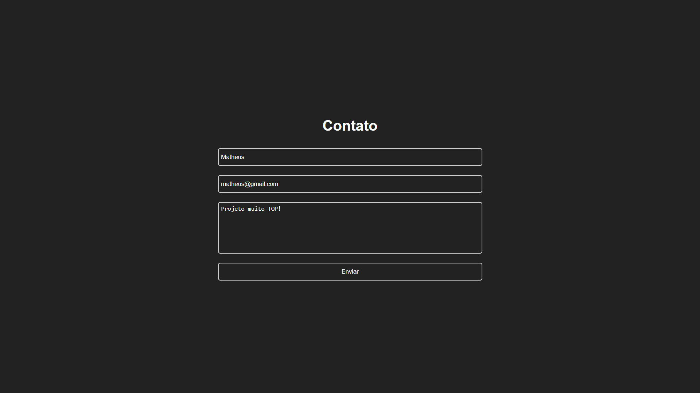

<!-- Título -->

<h1 align="center">Send E-mail</h1>

<!-- Descrição -->

Envio de e-mail através do EmailJS.

<!-- Súmario -->

 <a href="#rodando-a-aplicação">Rodando A Aplicação</a> •
 <a href="#tecnologias">Tecnologias</a> •
 <a href="#autor">Autor</a>

<!-- Site -->

<h2 align="center">Site</h2>

 <a href="https://matheuspalmieri-send-email.netlify.app/">Site Do Projeto</a>

---

### Rodando A Aplicação

<a href="https://matheuspalmieri-send-email.netlify.app/">Site do Projeto</a>

---

### Tecnologias

As seguintes ferramentas foram usadas na construção do projeto:

- [React JS](https://pt-br.reactjs.org/)
- [JavaScript](https://www.javascript.com/)
- [NPM](https://github.com/facebook/create-react-app)

---

### Autor

Create for <b>`Matheus Palmieri`</b>👨‍💻

 
 

🎉Projeto Send E-mail Finalizado🚀

